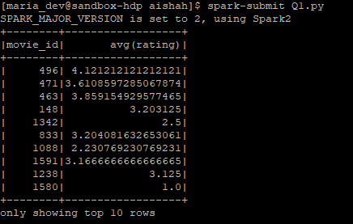
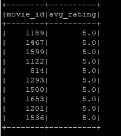
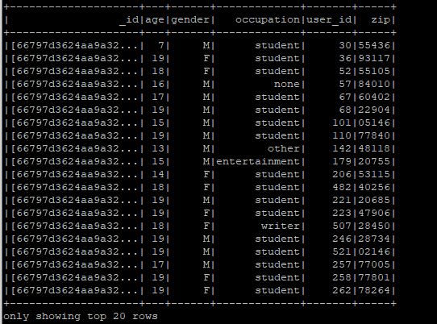
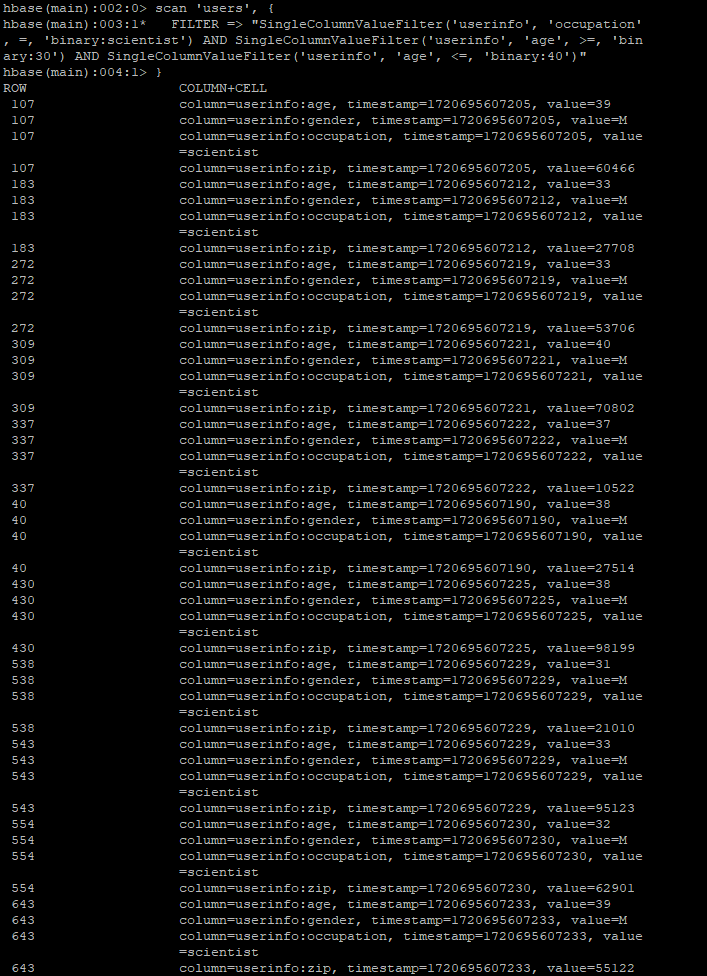

# Assignment 4

## Contents
1. [Introduction](#introduction)
2. [Questions and Solutions](#questions-and-solutions)
   - [Q1 - Spark](#q1---spark)
   - [Q2 & Q3 - Cassandra](#q2--q3---cassandra)
   - [Q4 - MongoDB](#q4---mongodb)
   - [Q5 - HBase](#q5---hbase)
3. [Conclusion](#conclusion)

## Introduction
This assignment contains the solutions for the Data Management assignment 4. The assignment consists of five questions, each involving different big data technologies: Spark, Cassandra, MongoDB, and HBase.

## Questions and Solutions

### Q1 - Spark
Identify the top ten movies with the highest average ratings.

```python
# average_ratings_spark.py
from pyspark.sql import SparkSession

# Initialize Spark session
spark = SparkSession.builder.appName("MovieRatings").getOrCreate()

# Load the dataset
data_path = "/user/maria_dev/aishah/u.data"
data = spark.read.csv(data_path, sep='\t', inferSchema=True).toDF("user_id", "movie_id", "rating", "timestamp")

# Calculate the average rating for each movie
avg_ratings = data.groupBy("movie_id").avg("rating")

# Show the result
avg_ratings.show(10)

# Coalesce the DataFrame into a single partition
avg_ratings = avg_ratings.coalesce(1)

# Save the result to a single file
output_path = "/user/maria_dev/aishah/average_ratings.csv"
avg_ratings.write.csv(output_path, header=True)

# Stop the Spark session
spark.stop()
```


### Q2 - Cassandra
Identify the top ten movies with the highest average ratings using Cassandra.

```python
from pyspark.sql import SparkSession

if __name__ == "__main__":
    spark = SparkSession.builder \
        .appName("CassandraIntegration") \
        .config("spark.cassandra.connection.host", "127.0.0.1") \
        .getOrCreate()

    # Read the CSV file from HDFS
    avgRatings = spark.read.csv("hdfs:///user/maria_dev/aishah/avg_ratings.csv", header=True, inferSchema=True)

    # Rename the columns to match Cassandra table schema
    avgRatings = avgRatings.withColumnRenamed("movie_id", "movie_id").withColumnRenamed("avg(rating)", "avg_rating")

    # Write the DataFrame to Cassandra
    avgRatings.write \
        .format("org.apache.spark.sql.cassandra") \
        .mode('append') \
        .options(table="avg_ratings", keyspace="movielens") \
        .save()

    # Read the data back from Cassandra to verify
    readAvgRatings = spark.read \
        .format("org.apache.spark.sql.cassandra") \
        .options(table="avg_ratings", keyspace="movielens") \
        .load()

    # Create a temporary view to run SQL queries
    readAvgRatings.createOrReplaceTempView("avg_ratings")

    # Query to find the top 10 movies with the highest average ratings
    topMoviesDF = spark.sql("SELECT movie_id, avg_rating FROM avg_ratings ORDER BY avg_rating DESC LIMIT 10")
    topMoviesDF.show()

    spark.stop()
```


### Q3 - Cassandra
Find the users who have rated at least 50 movies and identify their favourite movie genres.

```python
from pyspark.sql import SparkSession
from pyspark.sql import functions as F
from pyspark.sql.window import Window

def parse_user(line):
    fields = line.split('|')
    return (int(fields[0]), fields[1], fields[2], fields[3], fields[4])

def parse_rating(line):
    fields = line.split('\t')
    return (int(fields[0]), int(fields[1]), float(fields[2]))

def parse_item(line):
    fields = line.split('|')
    genres = [fields[i] for i in range(5, len(fields)) if int(fields[i]) == 1]
    return (int(fields[0]), genres)

if __name__ == "__main__":
    spark = SparkSession.builder \
        .appName("CassandraIntegration") \
        .config("spark.cassandra.connection.host", "127.0.0.1") \
        .getOrCreate()

    # Load the u.user file
    user_lines = spark.sparkContext.textFile("hdfs:///user/maria_dev/aishah/u.user")
    users = user_lines.map(parse_user).toDF(["user_id", "age", "gender", "occupation", "zip"])

    # Load the u.data file
    rating_lines = spark.sparkContext.textFile("hdfs:///user/maria_dev/aishah/u.data")
    ratings = rating_lines.map(parse_rating).toDF(["user_id", "movie_id", "rating"])

    # Load the u.item file
    item_lines = spark.sparkContext.textFile("hdfs:///user/maria_dev/aishah/u.item")
    items = item_lines.map(parse_item).toDF(["movie_id", "genres"])

    # Write user ratings to Cassandra
    ratings.write \
        .format("org.apache.spark.sql.cassandra") \
        .mode('append') \
        .options(table="user_ratings", keyspace="movielens") \
        .save()

    # Explode the genres and write to Cassandra
    items = items.withColumn("genre", F.explode(F.col("genres")))
    items.select("movie_id", "genre").write \
        .format("org.apache.spark.sql.cassandra") \
        .mode('append') \
        .options(table="movie_genres", keyspace="movielens") \
        .save()

    # Load data back from Cassandra for processing
    user_ratings = spark.read \
        .format("org.apache.spark.sql.cassandra") \
        .options(table="user_ratings", keyspace="movielens") \
        .load()

    movie_genres = spark.read \
        .format("org.apache.spark.sql.cassandra") \
        .options(table="movie_genres", keyspace="movielens") \
        .load()

    # Count the number of ratings per user
    user_ratings_count = user_ratings.groupBy("user_id").count().filter("count >= 50")

    # Join the user data with the user ratings count
    active_users = user_ratings_count.join(users, "user_id")

    # Join the ratings with the movie genres
    ratings_with_genres = user_ratings.join(movie_genres, "movie_id")

    # Filter to include only active users
    active_ratings_with_genres = ratings_with_genres.join(active_users, "user_id")

    # Calculate the average rating per genre per user
    user_genre_ratings = active_ratings_with_genres.groupBy("user_id", "genre").agg(F.avg("rating").alias("avg_rating"))

    # Identify the favorite genre for each user
    window_spec = Window.partitionBy("user_id").orderBy(F.desc("avg_rating"))
    favorite_genres = user_genre_ratings.withColumn("rank", F.rank().over(window_spec)).filter("rank == 1").select("user_id", "genre")

    # Show the results
    favorite_genres.show()

    spark.stop()
```
### Q4 - MongoDB
Find all users who are younger than 20 years old using MongoDB.

```python
from pyspark.sql import SparkSession
from pyspark.sql import Row

def parseInput(line):
    fields = line.split('|')
    return Row(user_id=int(fields[0]), age=int(fields[1]), gender=fields[2], occupation=fields[3], zip=fields[4])

if __name__ == "__main__":
    spark = SparkSession.builder.appName("MongoDBIntegration").getOrCreate()

    # Load data from u.user
    lines = spark.sparkContext.textFile("hdfs:///user/maria_dev/aishah/u.user")
    users = lines.map(parseInput)
    usersDataset = spark.createDataFrame(users)

    # Write to MongoDB
    usersDataset.write \
        .format("com.mongodb.spark.sql.DefaultSource") \
        .option("uri", "mongodb://127.0.0.1/movielens.users") \
        .mode('append') \
        .save()

    # Read it back from MongoDB into a DataFrame
    readUsers = spark.read \
        .format("com.mongodb.spark.sql.DefaultSource") \
        .option("uri", "mongodb://127.0.0.1/movielens.users") \
        .load()

    readUsers.createOrReplaceTempView("users")
    sqlDF = spark.sql("SELECT * FROM users WHERE age < 20")
    sqlDF.show()

    # Save the result to a CSV file
    sqlDF.drop("_id").write.csv("/user/maria_dev/aishah/users_under_20.csv")

    # Stop the session
    spark.stop()
```


### Q5 - HBase
Find all users who have the occupation "scientist" and their age is between 30 and 40 years old.

```python
users = LOAD '/user/maria_dev/aishah/u.user' USING PigStorage('|')
    AS (userID:int, age:int, gender:chararray, occupation:chararray, zip:int);

STORE users INTO 'hbase://users'
    USING org.apache.pig.backend.hadoop.hbase.HBaseStorage(
    'userinfo:age, userinfo:gender, userinfo:occupation, userinfo:zip');
```
# In HBase shell

```
scan 'users', { FILTER => "SingleColumnValueFilter('userinfo', 'occupation', =, 'binary:scientist') AND SingleColumnValueFilter('userinfo', 'age', >=, 'binary:30') AND SingleColumnValueFilter('userinfo', 'age', <=, 'binary:40')" }
```

.png)


