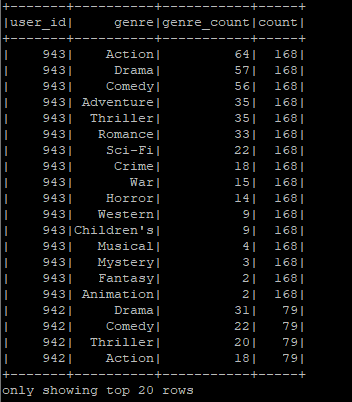

# Assignment 4

## Contents
1. [Introduction](#introduction)
2. [Questions and Solutions](#questions-and-solutions)
   - [Q1 - Spark](#q1---spark)
   - [Q2 & Q3 - Cassandra](#q2--q3---cassandra)
   - [Q4 - MongoDB](#q4---mongodb)
   - [Q5 - HBase](#q5---hbase)
3. [Conclusion](#conclusion)

## Introduction
This assignment contains the solutions for the Data Management assignment 4. The assignment consists of five questions, each involving different big data technologies: Spark, Cassandra, MongoDB, and HBase.

## Questions and Solutions

### Q1 - Spark
Identify the top ten movies with the highest average ratings.

```python
# average_ratings_spark.py
from pyspark.sql import SparkSession

# Initialize Spark session
spark = SparkSession.builder.appName("MovieRatings").getOrCreate()

# Load the dataset
data_path = "/user/maria_dev/aishah/u.data"
data = spark.read.csv(data_path, sep='\t', inferSchema=True).toDF("user_id", "movie_id", "rating", "timestamp")

# Calculate the average rating for each movie
avg_ratings = data.groupBy("movie_id").avg("rating")

# Show the result
avg_ratings.show(10)

# Coalesce the DataFrame into a single partition
avg_ratings = avg_ratings.coalesce(1)

# Save the result to a single file
output_path = "/user/maria_dev/aishah/average_ratings.csv"
avg_ratings.write.csv(output_path, header=True)

# Stop the Spark session
spark.stop()
```


### Q2 - Cassandra
Identify the top ten movies with the highest average ratings using Cassandra.

```python
from pyspark.sql import SparkSession

if __name__ == "__main__":
    spark = SparkSession.builder \
        .appName("CassandraIntegration") \
        .config("spark.cassandra.connection.host", "127.0.0.1") \
        .getOrCreate()

    # Read the CSV file from HDFS
    avgRatings = spark.read.csv("hdfs:///user/maria_dev/aishah/avg_ratings.csv", header=True, inferSchema=True)

    # Rename the columns to match Cassandra table schema
    avgRatings = avgRatings.withColumnRenamed("movie_id", "movie_id").withColumnRenamed("avg(rating)", "avg_rating")

    # Write the DataFrame to Cassandra
    avgRatings.write \
        .format("org.apache.spark.sql.cassandra") \
        .mode('append') \
        .options(table="avg_ratings", keyspace="movielens") \
        .save()

    # Read the data back from Cassandra to verify
    readAvgRatings = spark.read \
        .format("org.apache.spark.sql.cassandra") \
        .options(table="avg_ratings", keyspace="movielens") \
        .load()

    # Create a temporary view to run SQL queries
    readAvgRatings.createOrReplaceTempView("avg_ratings")

    # Query to find the top 10 movies with the highest average ratings
    topMoviesDF = spark.sql("SELECT movie_id, avg_rating FROM avg_ratings ORDER BY avg_rating DESC LIMIT 10")
    topMoviesDF.show()

    spark.stop()
```


### Q3 - Cassandra
Find the users who have rated at least 50 movies and identify their favourite movie genres.

```python
from pyspark.sql import SparkSession
from pyspark.sql import Row
from pyspark.sql import functions as F

def parse_user_ratings(line):
    fields = line.split('\t')
    return Row(user_id=int(fields[0]), movie_id=int(fields[1]), rating=float(fields[2]))

genre_list = [
    "unknown", "Action", "Adventure", "Animation", "Children's", "Comedy",
    "Crime", "Documentary", "Drama", "Fantasy", "Film-Noir", "Horror",
    "Musical", "Mystery", "Romance", "Sci-Fi", "Thriller", "War", "Western"
]

def parse_movie_genres(line):
    fields = line.split('|')
    movie_id = int(fields[0])
    genres = fields[5:]  # Assuming the first 5 fields are movie details and the rest are genres
    genre_rows = []
    for i in range(len(genres)):
        if genres[i] == '1':
            genre_rows.append(Row(movie_id=movie_id, genre=genre_list[i]))
    return genre_rows

if __name__ == "__main__":
    spark = SparkSession.builder \
        .appName("CassandraIntegration") \
        .config("spark.cassandra.connection.host", "127.0.0.1") \
        .getOrCreate()

    # Load user ratings data
    ratings_path = "hdfs:///user/maria_dev/aishah/u.data"
    ratings_lines = spark.sparkContext.textFile(ratings_path)
    user_ratings = ratings_lines.map(parse_user_ratings)
    user_ratings_df = spark.createDataFrame(user_ratings)

    # Load movie genres data
    genres_path = "hdfs:///user/maria_dev/aishah/u.item"
    genres_lines = spark.sparkContext.textFile(genres_path)
    movie_genres = genres_lines.flatMap(parse_movie_genres)
    movie_genres_df = spark.createDataFrame(movie_genres)

    # Write user ratings data to Cassandra
    user_ratings_df.write \
        .format("org.apache.spark.sql.cassandra") \
        .mode('append') \
        .options(table="user_ratings", keyspace="movielens") \
        .save()

    # Write movie genres data to Cassandra
    movie_genres_df.write \
        .format("org.apache.spark.sql.cassandra") \
        .mode('append') \
        .options(table="movie_genres", keyspace="movielens") \
        .save()

    # Find users who have rated at least 50 movies
    user_ratings_count = user_ratings_df.groupBy("user_id").count().filter("count >= 50")

    # Join user ratings with movie genres to find favourite genres
    user_favourite_genres = user_ratings_df.join(movie_genres_df, "movie_id") \
        .groupBy("user_id", "genre") \
        .agg(F.count("genre").alias("genre_count")) \
        .join(user_ratings_count, "user_id") \
        .orderBy("user_id", "genre_count", ascending=False)

    # Show the result
    user_favourite_genres.show()

    # Select only relevant columns for saving
    user_favourite_genres_selected = user_favourite_genres.select("user_id", "genre", "genre_count")

    # Save the result to Cassandra
    user_favourite_genres_selected.write \
        .format("org.apache.spark.sql.cassandra") \
        .mode('append') \
        .options(table="user_favourite_genres", keyspace="movielens") \
        .save()

    # Save the result to CSV
    output_path = "/user/maria_dev/aishah/user_favourite_genres.csv"
    user_favourite_genres_selected.coalesce(1).write.csv(output_path, header=True)

    # Stop the Spark session
    spark.stop()
```

.png)
.png)

### Q4 - MongoDB
Find all users who are younger than 20 years old using MongoDB.

```python
from pyspark.sql import SparkSession
from pyspark.sql import Row

def parseInput(line):
    fields = line.split('|')
    return Row(user_id=int(fields[0]), age=int(fields[1]), gender=fields[2], occupation=fields[3], zip=fields[4])

if __name__ == "__main__":
    spark = SparkSession.builder.appName("MongoDBIntegration").getOrCreate()

    # Load data from u.user
    lines = spark.sparkContext.textFile("hdfs:///user/maria_dev/aishah/u.user")
    users = lines.map(parseInput)
    usersDataset = spark.createDataFrame(users)

    # Write to MongoDB
    usersDataset.write \
        .format("com.mongodb.spark.sql.DefaultSource") \
        .option("uri", "mongodb://127.0.0.1/movielens.users") \
        .mode('append') \
        .save()

    # Read it back from MongoDB into a DataFrame
    readUsers = spark.read \
        .format("com.mongodb.spark.sql.DefaultSource") \
        .option("uri", "mongodb://127.0.0.1/movielens.users") \
        .load()

    readUsers.createOrReplaceTempView("users")
    sqlDF = spark.sql("SELECT * FROM users WHERE age < 20")
    sqlDF.show()

    # Save the result to a CSV file
    sqlDF.drop("_id").write.csv("/user/maria_dev/aishah/users_under_20.csv")

    # Stop the session
    spark.stop()
```


### Q5 - HBase
Find all users who have the occupation "scientist" and their age is between 30 and 40 years old.

```python
users = LOAD '/user/maria_dev/aishah/u.user' USING PigStorage('|')
    AS (userID:int, age:int, gender:chararray, occupation:chararray, zip:int);

STORE users INTO 'hbase://users'
    USING org.apache.pig.backend.hadoop.hbase.HBaseStorage(
    'userinfo:age, userinfo:gender, userinfo:occupation, userinfo:zip');
```
#### In HBase shell

```
scan 'users', { FILTER => "SingleColumnValueFilter('userinfo', 'occupation', =, 'binary:scientist') AND SingleColumnValueFilter('userinfo', 'age', >=, 'binary:30') AND SingleColumnValueFilter('userinfo', 'age', <=, 'binary:40')" }
```

.png)

## Conclusion
This assignment demonstrates how to perform various data management tasks using different big data technologies such as Spark, Cassandra, MongoDB, and HBase. Each question in the assignment is solved using the appropriate technology and the results are provided.


